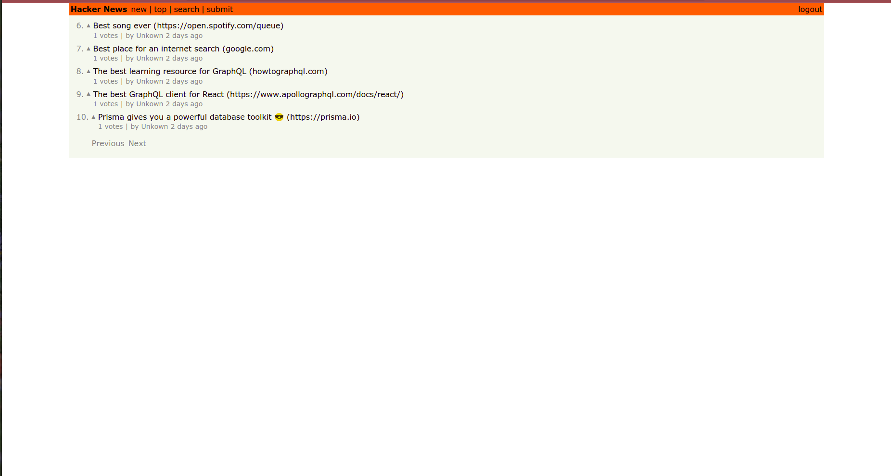

# GraphQL Hacker News Clone

This project was built as a [tutorial](https://www.howtographql.com/react-apollo/0-introduction/) on GraphQL. The project is a clone of Hacker News. Check out the final outcome on the screenshot below.

## Table of contents

- [Overview](#overview)
  - [The challenge](#the-challenge)
  - [Screenshot](#screenshot)
  - [App Features](#app-features)
- [My process](#my-process)
  - [Built with](#built-with)
  - [What I learned](#what-i-learned)
- [Installation](#installation)
- [Author](#author)

## Overview

### The challenge

To build a clone of the Hacker News website using:

- [React JS](https://reactjs.org/)
- [GraphQL](https://graphql.org/)
- [Apollo](https://www.apollographql.com/)
- [Prisma](https://www.prisma.io/graphql)

### Screenshots



### App Features

- Displays a list of links
- Ability to search the list of links
- Handles user authentication
- Allows authenticated users to create new links
- Allows authenticated users to upvote links (one vote per link and user)
- Realtime updates when other users upvote a link or create a new one

## My process

### Built with

- The GraphQL Node JS server from [this](https://www.howtographql.com/graphql-js/0-introduction) tutorial. Used this server as the backend server.
- An SQLite DB for tutorial purposes. All processes implemented can however make use of other DBs like MongoDB or MySQL.


### What I learned

How to initialize the Apollo Client in React for Authentication, Cache and WebSockets use with a GraphQL back-end server.

```js
const httpLink = createHttpLink({
  uri: 'http://localhost:4000'
});

const authLink = setContext((_, { headers }) => {
  const token = localStorage.getItem(AUTH_TOKEN);
  return {
    headers: {
      ...headers,
      authorization: token ? `Bearer ${token}` : ''
    }
  };
});

const wsLink = new WebSocketLink({
  uri: `ws://localhost:4000/graphql`,
  options: {
    reconnect: true,
    connectionParams: {
      authToken: localStorage.getItem(AUTH_TOKEN)
    }
  }
});

const link = split(
  ({ query }) => {
    const { kind, operation } = getMainDefinition(query);
    return (
      kind === 'OperationDefinition' &&
      operation === 'subscription'
    );
  },
  wsLink,
  authLink.concat(httpLink)
);

const client = new ApolloClient({
  link,
  cache: new InMemoryCache()
});
```

How to send GraphQL Queries, Mutations and Subscriptions to a back-end server using the Apollo Client.

```js
const CREATE_LINK_MUTATION = gql`
    mutation PostMutation(
        $description: String!
        $url: String!
    ) {
        post(description: $description, url: $url) {
            id
            createdAt,
            url
            description
        }
    }
`;
```

## Installation

This project was initialized with yarn but you can use the relevant npm commands for each yarn command below. After cloning the project run:

```
$ yarn add
```
to install all dependencies. Then run:
```
$ yarn start
```
to start the React App. Also run:
```
$ cd server && yarn dev
```
to start the GraphQL back-end server.

## Author

- Website - [Hillary Wando](http://hillarywando.com/)
- Codepen - [@Wandonium](https://codepen.io/wandonium)
- Twitter - [@hillarywando](https://www.twitter.com/hillarywando)

